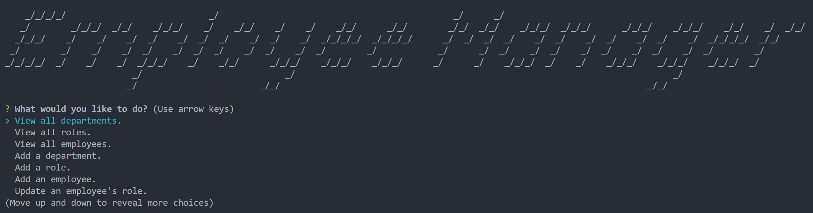
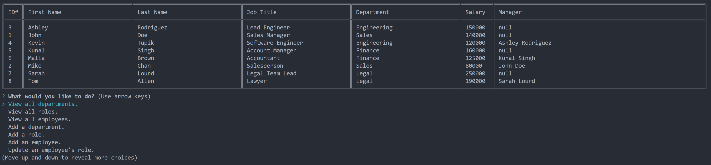

# Employee Database Manager  
[](https://opensource.org/licenses/MIT)   

## Description  

The purpose of this is to create a program which allows employers to create an easy to use database to track internal data about their employees.

**User Story**
```
AS A business owner
I WANT to be able to view and manage the departments, roles, and employees in my company
SO THAT I can organize and plan my business
```

**Acceptance Criteria**
```
GIVEN a command-line application that accepts user input
WHEN I start the application
THEN I am presented with the following options: view all departments, view all roles, view all employees, add a department, add a role, add an employee, and update an employee role
WHEN I choose to view all departments
THEN I am presented with a formatted table showing department names and department ids
WHEN I choose to view all roles
THEN I am presented with the job title, role id, the department that role belongs to, and the salary for that role
WHEN I choose to view all employees
THEN I am presented with a formatted table showing employee data, including employee ids, first names, last names, job titles, departments, salaries, and managers that the employees report to
WHEN I choose to add a department
THEN I am prompted to enter the name of the department and that department is added to the database
WHEN I choose to add a role
THEN I am prompted to enter the name, salary, and department for the role and that role is added to the database
WHEN I choose to add an employee
THEN I am prompted to enter the employee’s first name, last name, role, and manager, and that employee is added to the database
WHEN I choose to update an employee role
THEN I am prompted to select an employee to update and their new role and this information is updated in the database 
```  

## Table of Contents  
1. [Description](#description)  
2. [Installation](#installation)  
3. [Usage](#usage)  
4. [Contributing](#contributing)  
5. [Tests](#tests)  
6. [Questions](#questions)  
7. [License](#license)
## Installation  

1. Download. 
2. Login to your **mysql** shell and run schema.sql. Optionally, you may also run the seeds.sql.
3. Create a .env file in the root and enter the following information:
```
DB_NAME=employees_db  
DB_USERNAME=YOUR_MYSQL_USERNAME_GOES_HERE (default is root)  
DB_PASSWORD=YOUR_MYSQL_PASSWORD_GOES_HERE  
```
4. Run ```npm i``` from the terminal while in the folder location. 
5. Enter the command ```node index.js```.  

## Usage  

**[Walkthrough Video](https://drive.google.com/file/d/1bmcOn1soIZEP6wXATo3wsAhYo2cORi4V/view?usp=sharing)**

 

 

 

## Contributing  

Follow best practices for naming conventions, indentation, quality comments, etc.  

## Tests  

A seeds.sql file is included for testing purposes. These examples are fictitious and any similarity to actual persons, living or dead, is entirely coincidental.

## Questions  

If you have any questions, please reach out to me either on Github or by Email.
  - **Github:** [mmelan000](https://github.com/mmelan000)
  - **Email:** [m.melanson000@gmail.com](mailto:m.melanson000@gmail.com)

## License  

- [MIT](https://opensource.org/licenses/MIT)

